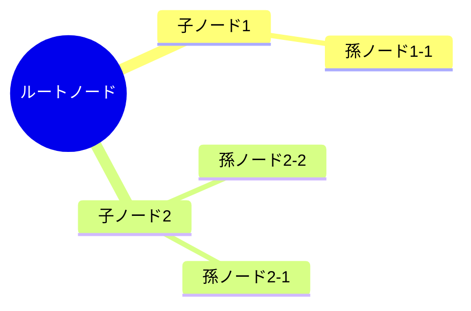
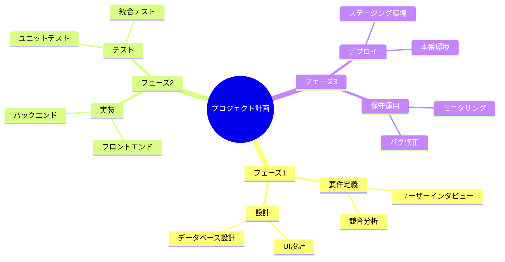

# Mermaid形式エクスポート/インポート機能仕様

## 1. 概要

マインドマップエディタで作成したコンテンツをMermaid mindmap構文でエクスポートし、また既存のMermaid構文からインポートできる機能を追加します。ユーザーはモーダルダイアログを介して、テキストベースでマインドマップを編集・共有できるようになります。

## 2. ユースケース

- マインドマップをテキスト形式で保存・共有したい場合
- 既存のMermaid mindmap構文からマインドマップを作成したい場合
- バージョン管理システム（Git等）でマインドマップの差分を管理したい場合
- 他のツールで作成したMermaid mindmapを読み込みたい場合

## 3. UI/UX仕様

### 3.1 ボタン配置

- **配置場所**: 画面上部のツールバー（ヘッダー領域）
- **ボタン構成**:
  - **エクスポートボタン**: 「Export Mermaid」または「📤 Mermaid」
  - **インポートボタン**: 「Import Mermaid」または「📥 Mermaid」
- **配置順序**: インポートボタン → エクスポートボタン（左から右）
- **スタイル**: 既存のツールバーボタンと統一したデザイン

### 3.2 エクスポート機能

#### 3.2.1 動作フロー

1. ユーザーが「エクスポート」ボタンをクリック
2. モーダルダイアログが表示される
3. TextArea内に現在のマインドマップのMermaid構文が自動的に表示される
4. ユーザーはテキストをコピー可能
5. モーダルを閉じる（構文のみの表示で終了）

#### 3.2.2 モーダル仕様

- **タイトル**: 「Export to Mermaid」
- **サイズ**: 中サイズ（幅600px、高さ500px程度）
- **構成要素**:
  - タイトルバー
  - 読み取り専用のTextArea（`readonly`属性）
    - 幅: モーダル幅の90%
    - 高さ: 350px程度
    - 等幅フォント（monospace）
    - 構文ハイライトは不要（プレーンテキスト）
  - 「Copy to Clipboard」ボタン（オプション）
  - 「Close」ボタン

### 3.3 インポート機能

#### 3.3.1 動作フロー

1. ユーザーが「インポート」ボタンをクリック
2. モーダルダイアログが表示される
3. TextAreaは空の状態（またはプレースホルダーテキスト表示）
4. ユーザーがMermaid構文を貼り付け/入力
5. 「Import」ボタンをクリック
6. 構文が解析され、マインドマップに変換
7. 成功時: モーダルが閉じ、新しいマインドマップが表示される
8. エラー時: エラーメッセージをモーダル内に表示

#### 3.3.2 モーダル仕様

- **タイトル**: 「Import from Mermaid」
- **サイズ**: 中サイズ（幅600px、高さ550px程度）
- **構成要素**:
  - タイトルバー
  - 編集可能なTextArea
    - 幅: モーダル幅の90%
    - 高さ: 350px程度
    - 等幅フォント（monospace）
    - プレースホルダー: 例のMermaid構文を表示
  - エラー表示エリア（エラー発生時のみ表示）
    - 赤色のアラート
    - 具体的なエラー内容を表示
  - アクションボタン:
    - 「Cancel」ボタン（左）
    - 「Import」ボタン（右、プライマリ）

### 3.4 プレースホルダー例

```
mindmap
  root((マインドマップ))
    トピック1
      サブトピック1-1
      サブトピック1-2
    トピック2
      サブトピック2-1
```

## 4. Mermaid構文仕様

### 4.1 サポートするMermaid構文

Mermaid mindmap構文の基本形式のみをサポート:



### 4.2 構文ルール

- **ルートノード**: `root((テキスト))` で表現（二重括弧）
- **子ノード**: インデント（2スペースまたは4スペース）で階層を表現
- **テキスト**: ノードのラベルテキスト
- **階層**: インデントレベルで親子関係を表現

### 4.3 制限事項

以下の高度な機能は**現時点ではサポート外**:

- アイコン・絵文字
- スタイルのカスタマイズ（色、形状など）
- ノードの形状バリエーション（角丸、六角形など）
- クラス定義

将来的な拡張として検討可能。

## 5. 技術実装計画

### 5.1 必要なコンポーネント

```typescript
// モーダルコンポーネント
interface MermaidExportModalProps {
  isOpen: boolean
  onClose: () => void
  mermaidSyntax: string
}

interface MermaidImportModalProps {
  isOpen: boolean
  onClose: () => void
  onImport: (doc: Doc) => void
}
```

### 5.2 エクスポート処理

#### 5.2.1 マインドマップ → Mermaid変換

```typescript
const exportToMermaid = (doc: Doc, graph: MindmapGraph): string => {
  const lines: string[] = ['mindmap']
  
  // ルートノードを取得
  const rootNode = doc.nodes.find(n => n.id === graph.rootId)
  if (!rootNode) return ''
  
  // ルートを追加
  lines.push(`  root((${rootNode.text}))`)
  
  // 再帰的に子ノードを追加
  const buildTree = (nodeId: string, depth: number) => {
    const children = graph.childrenMap.get(nodeId) || []
    children.forEach(childId => {
      const child = doc.nodes.find(n => n.id === childId)
      if (child && child.t === 'text') {
        const indent = '  '.repeat(depth + 1)
        lines.push(`${indent}${child.text}`)
        buildTree(childId, depth + 1)
      }
    })
  }
  
  buildTree(graph.rootId, 1)
  
  return lines.join('\n')
}
```

### 5.3 インポート処理

#### 5.3.1 Mermaid → マインドマップ変換

```typescript
interface ParsedNode {
  text: string
  depth: number
  children: ParsedNode[]
}

const importFromMermaid = (syntax: string): Doc => {
  // 1. 構文を行ごとに分割
  const lines = syntax.split('\n').filter(line => line.trim() !== '')
  
  // 2. "mindmap" ヘッダーをチェック
  if (lines[0].trim() !== 'mindmap') {
    throw new Error('Invalid Mermaid syntax: must start with "mindmap"')
  }
  
  // 3. ルートノードを解析
  const rootMatch = lines[1].match(/root\(\((.*?)\)\)/)
  if (!rootMatch) {
    throw new Error('Invalid Mermaid syntax: root node not found')
  }
  const rootText = rootMatch[1]
  
  // 4. ツリー構造を解析
  const tree = parseTree(lines.slice(2))
  
  // 5. Doc構造に変換
  return buildDoc(rootText, tree)
}

const parseTree = (lines: string[]): ParsedNode[] => {
  // インデントレベルを解析してツリー構造を構築
  const nodes: ParsedNode[] = []
  const stack: { depth: number; node: ParsedNode }[] = []
  
  lines.forEach(line => {
    const depth = (line.match(/^ */)?.[0].length || 0) / 2
    const text = line.trim()
    
    const node: ParsedNode = { text, depth, children: [] }
    
    // スタックから適切な親を見つける
    while (stack.length > 0 && stack[stack.length - 1].depth >= depth) {
      stack.pop()
    }
    
    if (stack.length > 0) {
      stack[stack.length - 1].node.children.push(node)
    } else {
      nodes.push(node)
    }
    
    stack.push({ depth, node })
  })
  
  return nodes
}

const buildDoc = (rootText: string, tree: ParsedNode[]): Doc => {
  const nodes: Node[] = []
  const rootId = nanoid()
  
  // ルートノードを作成
  const rootNode: TextNode = {
    id: rootId,
    t: 'text',
    s: 0,
    x: 0,
    y: 0,
    w: 50,
    h: 12,
    text: rootText,
    align: 'c',
    backgroundColor: '#dbeafe',
    borderColor: '#3b82f6',
    borderWidth: 1,
    padding: 3,
    fontSize: 5.64,
    locked: true
  }
  
  nodes.push(rootNode)
  
  // 再帰的に子ノードを作成
  const buildNodes = (
    parentId: string,
    children: ParsedNode[],
    parentX: number,
    parentY: number,
    isLeft: boolean
  ) => {
    children.forEach((child, index) => {
      const childId = nanoid()
      const linkId = nanoid()
      
      // 子ノードの位置を計算（仮の配置）
      const offsetX = isLeft ? -60 : 60
      const offsetY = index * 30
      
      const childNode: TextNode = {
        id: childId,
        t: 'text',
        s: 0,
        x: parentX + offsetX,
        y: parentY + offsetY,
        w: 40,
        h: 10,
        text: child.text,
        align: 'c',
        backgroundColor: '#ffffff',
        borderColor: '#64748b',
        borderWidth: 0.5,
        padding: 2,
        fontSize: 4.23,
        locked: true,
        data: { layoutDir: isLeft ? 'left' : 'right' }
      }
      
      const link: LineNode = {
        id: linkId,
        t: 'line',
        s: 0,
        pts: [0, 0, 0, 0],
        stroke: '#94a3b8',
        strokeW: 1,
        routing: 'orthogonal',
        startConn: { nodeId: parentId, anchor: 'auto' },
        endConn: { nodeId: childId, anchor: 'auto' },
        locked: true
      }
      
      nodes.push(childNode, link)
      
      // 孫ノードを再帰的に作成
      if (child.children.length > 0) {
        buildNodes(childId, child.children, childNode.x, childNode.y, isLeft)
      }
    })
  }
  
  // ルートの子ノードを左右に分配
  const leftChildren = tree.filter((_, i) => i % 2 === 0)
  const rightChildren = tree.filter((_, i) => i % 2 !== 0)
  
  buildNodes(rootId, leftChildren, 0, 0, true)
  buildNodes(rootId, rightChildren, 0, 0, false)
  
  return { nodes }
}
```

### 5.4 エラーハンドリング

```typescript
class MermaidImportError extends Error {
  constructor(message: string, public line?: number) {
    super(message)
    this.name = 'MermaidImportError'
  }
}

// エラーの種類
const ERROR_MESSAGES = {
  INVALID_HEADER: 'Invalid syntax: must start with "mindmap"',
  MISSING_ROOT: 'Root node not found or invalid format',
  INVALID_INDENT: 'Invalid indentation at line {line}',
  EMPTY_CONTENT: 'No content to import'
}
```

### 5.5 コンポーネント構成

```
MindmapEditor
  └── Toolbar
      ├── ImportMermaidButton
      │   └── MermaidImportModal
      │       ├── TextArea (editable)
      │       ├── ErrorDisplay
      │       └── Actions (Cancel, Import)
      └── ExportMermaidButton
          └── MermaidExportModal
              ├── TextArea (readonly)
              ├── CopyButton (optional)
              └── Actions (Close)
```

## 6. 実装手順

### Phase 1: UIコンポーネントの作成
1. `MermaidExportModal.tsx` の作成
2. `MermaidImportModal.tsx` の作成
3. ツールバーへのボタン追加

### Phase 2: エクスポート機能の実装
1. `exportToMermaid` 関数の実装
2. エクスポートボタンのイベントハンドラー
3. モーダル表示とクリップボードコピー機能

### Phase 3: インポート機能の実装
1. `parseTree` 関数の実装（構文解析）
2. `buildDoc` 関数の実装（Doc構造への変換）
3. `importFromMermaid` 関数の統合
4. エラーハンドリングの実装

### Phase 4: レイアウト自動調整
1. インポート後に `useMindmapLayout` でレイアウトを再計算
2. 初期配置の最適化

### Phase 5: テストと改善
1. 各種エッジケースのテスト
2. エラーメッセージの改善
3. UXの調整

## 7. 既存コードとの整合性

### 7.1 既存フックとの連携

- `useMindmapGraph`: グラフ構造の取得（エクスポート時）
- `useMindmapLayout`: インポート後のレイアウト自動調整
- `setDoc`: インポート時のドキュメント更新

### 7.2 既存型定義の利用

- `Doc`, `TextNode`, `LineNode`: 既存の型をそのまま使用
- `MindmapGraph`: グラフ構造の参照

## 8. テスト計画

### 8.1 ユニットテスト

- **エクスポート関数**
  - 入力: 単純なマインドマップ（ルート + 子2つ） → 期待: 正しいMermaid構文
  - 入力: 深い階層（5階層） → 期待: 正しいインデント
  - 入力: 空のマインドマップ → 期待: ルートのみのMermaid構文
- **インポート関数**
  - 入力: 基本的なMermaid構文 → 期待: 正しいDoc構造
  - 入力: 不正な構文（`mindmap`なし） → 期待: エラー
  - 入力: ルートノードなし → 期待: エラー
  - 入力: インデント不正 → 期待: エラー
- **構文解析**
  - 入力: 2スペースインデント → 期待: 正しくパース
  - 入力: 4スペースインデント → 期待: 正しくパース
  - 入力: 混在インデント → 期待: エラーまたは警告

### 8.2 インテグレーションテスト

- エクスポート → インポートの往復テスト
  - シナリオ: マインドマップをエクスポートし、その構文を再度インポート
  - 検証: 元のツリー構造が再現される（テキストと階層構造）
- 複雑なツリー構造の変換
  - シナリオ: 左右に子ノードがある複雑なマインドマップ
  - 検証: 全てのノードが正しく変換される

### 8.3 E2Eテスト

- **エクスポート操作**: ボタンクリック → モーダル表示 → Mermaid構文表示
- **インポート操作**: ボタンクリック → 構文入力 → 正常にインポート
- **エラー表示**: 不正な構文でインポート → エラーメッセージ表示

## 9. 考慮事項

### 9.1 パフォーマンス

- 大規模なマインドマップ（100ノード以上）のエクスポート/インポート性能
- TextAreaの描画パフォーマンス（長大なテキスト）

### 9.2 ユーザビリティ

- エクスポートしたテキストの可読性（インデント、改行）
- エラーメッセージの分かりやすさ
- プレースホルダーの有用性

### 9.3 エッジケース

- 特殊文字を含むノードテキスト（括弧、改行など）
- 非常に長いノードテキスト
- 空のノードテキスト

## 10. 今後の拡張案

- **構文ハイライト**: TextArea内でMermaid構文をハイライト表示
- **プレビュー機能**: インポート前にプレビュー表示
- **ファイル入出力**: `.mmd` ファイルとして保存/読み込み
- **スタイル情報の保持**: ノードの色や形状をMermaid構文で表現
- **クリップボードからの自動検出**: クリップボードにMermaid構文があれば自動認識
- **バリデーション**: リアルタイムでの構文チェックとエラー表示

## 11. 参考資料

### Mermaid mindmap構文の例



### 実装の優先順位

1. **Phase 1-2（高優先度）**: 基本的なエクスポート機能（読み取り専用表示）
2. **Phase 3（高優先度）**: 基本的なインポート機能（シンプルな構造のみ）
3. **Phase 4（中優先度）**: レイアウト最適化
4. **Phase 5（中優先度）**: エラーハンドリングの強化
5. **拡張機能（低優先度）**: 構文ハイライト、プレビューなど
