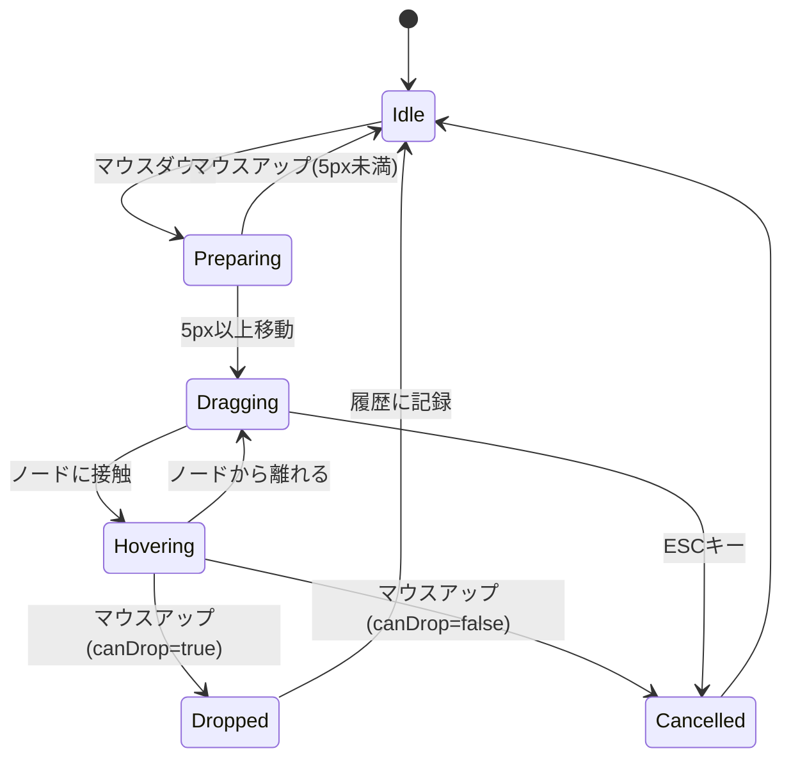

# マインドマップノードのドラッグによる付け替え機能仕様

## 1. 概要

マインドマップエディタでノードをドラッグ＆ドロップ操作により、ノードの親子関係を変更できる機能を追加します。ユーザーはノードを他のノード上にドロップすることで、そのノードをドロップ先の子ノードとして付け替えることができます。

## 2. ユースケース

- ノードを別のブランチに移動したい場合
- ノードの階層構造を再編成したい場合
- 関連するノードをグループ化したい場合

## 3. UI/UX仕様

### 3.1 ドラッグ操作

- ノード上でマウスダウンし、**一定距離（5px以上）移動した時点**でドラッグモードに入る
  - この判定により、クリック操作とドラッグ操作を明確に区別
  - 5px未満の移動ではドラッグモードに入らず、通常のクリックとして扱う
- ドラッグ中はノードのコピー（半透明、不透明度 0.6）がマウスに追従
- マウスボタンを放すと、マウス位置にあるノードにドロップ処理を実行

### 3.2 ドロップターゲットの視覚的フィードバック

- ドロップ可能なノードにマウスが乗ると、そのノードの枠を強調表示
- ドロップ位置に応じて以下のフィードバック：
  - **子としてドロップ可能**: ノードの枠を緑色（`hsl(142, 70%, 50%)`）でハイライト（太さ 3px）
  - **兄弟としてドロップ可能**: ノードの上端または下端に青色（`hsl(217, 91%, 60%)`）の挿入ラインを表示
  - **自分自身/祖先ノード**: 赤色（`hsl(0, 70%, 50%)`）で×マークを表示（ドロップ不可）

#### ドロップ位置の判定

- マウスY座標がノードの中央±20%の範囲内：**子として**ドロップ
- マウスY座標がノードの上部20%以内：**前の兄弟として**ドロップ
- マウスY座標がノードの下部20%以内：**次の兄弟として**ドロップ

### 3.3 ドロップ時の挙動

- **子としてドロップ**: ドロップ先ノードの最後の子として追加される
- **兄弟としてドロップ**: ドロップ先ノードの前または後ろに兄弟として挿入される
- ドロップしたノードの**子孫ノードも一緒に移動**する（サブツリー全体が移動）
- 自分自身や祖先ノードにはドロップ不可（循環参照の防止）
- ドロップ操作は**アンドゥ/リドゥ履歴に記録**され、元に戻すことが可能

### 3.4 制限事項

- ルートノードはドロップ不可（移動できない）
- 自分自身の祖先ノードにはドロップ不可（循環参照の防止）

## 4. 技術実装計画

### 4.1 必要な状態管理

```typescript
interface DragState {
  isDragging: boolean
  draggedNodeId: string | null
  dragStartPosition: { x: number; y: number } | null  // ドラッグ開始位置（距離判定用）
  dragPosition: { x: number; y: number } | null        // 現在のマウス位置
  dropTargetId: string | null
  dropPosition: 'child' | 'before' | 'after' | null    // ドロップ位置の種類
  canDrop: boolean
}
```

**状態管理の場所**: 
- ドラッグ状態は `MindmapEditor` コンポーネント内で `useState` を使用してローカル管理
- キャンバスのスクロール位置は既存の `stageRef` から取得し、ドラッグ中も考慮

### 4.2 実装コンポーネント

#### 4.2.1 ドラッグハンドラー

```typescript
const handleNodeMouseDown = (nodeId: string, e: Konva.KonvaEventObject<MouseEvent>) => {
  // ルートノードはドラッグ不可
  if (nodeId === graph.rootId) return
  
  // ドラッグ準備状態（まだドラッグモードには入らない）
  setDragState({
    isDragging: false,  // まだドラッグ開始していない
    draggedNodeId: nodeId,
    dragStartPosition: { x: e.evt.clientX, y: e.evt.clientY },
    dragPosition: { x: e.evt.clientX, y: e.evt.clientY },
    dropTargetId: null,
    dropPosition: null,
    canDrop: false,
  })
}

const handleStageMouseMove = (e: Konva.KonvaEventObject<MouseEvent>) => {
  if (!dragState.draggedNodeId) return
  
  const currentPos = { x: e.evt.clientX, y: e.evt.clientY }
  const distance = Math.hypot(
    currentPos.x - (dragState.dragStartPosition?.x ?? 0),
    currentPos.y - (dragState.dragStartPosition?.y ?? 0)
  )
  
  // 5px以上移動したらドラッグ開始
  if (distance > 5 && !dragState.isDragging) {
    setDragState(prev => ({ ...prev, isDragging: true }))
  }
  
  // ドラッグ中の座標更新
  if (dragState.isDragging) {
    setDragState(prev => ({ ...prev, dragPosition: currentPos }))
  }
}

const handleNodeMouseUp = () => {
  // ドロップ処理を実行
  if (dragState.canDrop && dragState.dropTargetId && dragState.draggedNodeId && dragState.dropPosition) {
    handleNodeReplace(dragState.draggedNodeId, dragState.dropTargetId, dragState.dropPosition)
  }
  setDragState(initialState)
}
```

#### 4.2.2 ドロップターゲット検出

```typescript
const handleNodeMouseEnter = (targetNodeId: string, e: Konva.KonvaEventObject<MouseEvent>) => {
  if (!dragState.isDragging) return

  const isAncestor = graph.isAncestor(dragState.draggedNodeId!, targetNodeId)
  const isSelf = targetNodeId === dragState.draggedNodeId
  const canDrop = !isAncestor && !isSelf
  
  // ドロップ位置を判定（Y座標に基づく）
  const nodeRect = e.target.getClientRect()
  const relativeY = (e.evt.clientY - nodeRect.y) / nodeRect.height
  
  let dropPosition: 'child' | 'before' | 'after' = 'child'
  if (relativeY < 0.2) {
    dropPosition = 'before'
  } else if (relativeY > 0.8) {
    dropPosition = 'after'
  }

  setDragState(prev => ({
    ...prev,
    dropTargetId: targetNodeId,
    dropPosition,
    canDrop,
  }))
}
```

#### 4.2.3 ノードの付け替え処理

```typescript
const handleNodeReplace = (
  sourceId: string, 
  targetId: string, 
  position: 'child' | 'before' | 'after'
) => {
  // アンドゥ/リドゥ用のコマンドを作成
  const command = {
    execute: () => {
      // 既存の親子関係を保存（アンドゥ用）
      const oldParentId = graph.parentIdMap.get(sourceId)
      const oldIndex = oldParentId 
        ? graph.childrenMap.get(oldParentId)?.indexOf(sourceId) ?? -1
        : -1
      
      if (oldParentId) {
        operations.removeChildNode(oldParentId, sourceId)
      }

      // 新しい親子関係を確立
      if (position === 'child') {
        operations.addChildNodeTo(targetId, sourceId)
      } else {
        const targetParentId = graph.parentIdMap.get(targetId)
        if (targetParentId) {
          const siblings = graph.childrenMap.get(targetParentId) ?? []
          const targetIndex = siblings.indexOf(targetId)
          const insertIndex = position === 'before' ? targetIndex : targetIndex + 1
          operations.insertChildNodeAt(targetParentId, sourceId, insertIndex)
        }
      }
      
      return { oldParentId, oldIndex }
    },
    undo: (context: { oldParentId: string | undefined, oldIndex: number }) => {
      // 現在の親から削除
      const currentParentId = graph.parentIdMap.get(sourceId)
      if (currentParentId) {
        operations.removeChildNode(currentParentId, sourceId)
      }
      
      // 元の位置に戻す
      if (context.oldParentId && context.oldIndex >= 0) {
        operations.insertChildNodeAt(context.oldParentId, sourceId, context.oldIndex)
      }
    }
  }
  
  // 履歴に追加して実行
  historyManager.execute(command)
}
```

### 4.3 コンポーネント構成

```
MindmapEditor
  ├── KonvaCanvasEditor
  │   └── CanvasElementRenderer (各ノードの描画)
  │       ├── ドラッグ可能ノード判定
  │       ├── ドロップターゲットのハイライト表示
  │       └── ドラッグ中のゴーストノード表示
  └── DragOverlay (ドラッグ中の視覚的フィードバック)
```

### 4.4 レイアウト自動更新

ノードの付け替え後、`useMindmapLayout` フックによりレイアウトが自動的に再計算され、ノードの位置が更新されます。

## 5. 実装手順

### Phase 1: ドラッグ操作の実装
1. CanvasElementRenderer にドラッグイベントハンドラーを追加
2. ドラッグ状態の管理
3. ドラッグ中のゴーストノード表示

### Phase 2: ドロップ検出の実装
1. ドロップターゲットの検出ロジック
2. 祖先チェック（循環参照防止）
3. ドロップ可否の判定

### Phase 3: 視覚的フィードバックの実装
1. ドロップターゲットのハイライト表示
2. ドロップ不可の視覚的フィードバック

### Phase 4: 付け替え処理の実装
1. ノードの付け替え処理
2. レイアウトの自動更新

### Phase 5: 履歴管理との統合
1. アンドゥ/リドゥコマンドの実装
2. 履歴マネージャーとの統合
3. 操作の元に戻す機能のテスト

### Phase 6: 詳細なユーザビリティ向上
1. キャンセル操作（ESCキー）
2. スクロール中のドラッグ対応
3. 複数選択ノードのドラッグ対応（オプション）
4. アニメーション効果の追加（オプション）

## 6. 既存コードとの整合性

### 6.1 既存フックとの連携

- `useMindmapOperations`: ノード操作関数を利用（`removeChildNode`, `addChildNodeTo`, `insertChildNodeAt`）
- `useMindmapGraph`: グラフ構造情報を利用（`isAncestor`, `parentIdMap`, `childrenMap`）
- `useMindmapLayout`: 付け替え後のレイアウト自動更新
- `useHistoryManager`: アンドゥ/リドゥ機能との統合（コマンドパターンを使用）

### 6.2 Konva コンポーネントとの連携

- KonvaStage のイベントを利用してドラッグ操作を検出
- `CanvasElementRenderer` にドラッグ＆ドロップ機能を追加

## 7. 考慮事項

### 7.1 パフォーマンス

- ドラッグ中のレンダリングを最適化（batchDraw 使用）
- 不要な再計算を避ける

### 7.2 アクセシビリティ

- キーボードでのノード移動も考慮する（オプション）

### 7.3 エッジケース

- ドラッグ中にレイアウトが変わった場合の挙動
- 子ノードが多数ある場合のパフォーマンス
- キャンバスのズーム/パン中のドラッグ操作
- 画面外のノードへのドラッグ（自動スクロール）

## 8. テスト計画

### 8.1 ユニットテスト

- **ドロップ可否判定ロジック**
  - 入力: `(draggedNodeId: 'A', targetNodeId: 'B')` → 期待: `canDrop = true`
  - 入力: `(draggedNodeId: 'A', targetNodeId: 'A')` → 期待: `canDrop = false` (自分自身)
  - 入力: `(draggedNodeId: 'A', targetNodeId: 'A-child')` → 期待: `canDrop = false` (子孫)
- **祖先チェックロジック** (`isAncestor`)
  - 入力: `(ancestorId: 'A', descendantId: 'A-child-grandchild')` → 期待: `true`
  - 入力: `(ancestorId: 'A', descendantId: 'B')` → 期待: `false`
- **ドロップ位置判定ロジック**
  - `relativeY = 0.1` → 期待: `dropPosition = 'before'`
  - `relativeY = 0.5` → 期待: `dropPosition = 'child'`
  - `relativeY = 0.9` → 期待: `dropPosition = 'after'`
- **ノード付け替え処理**
  - 子としての追加が正しく機能するか
  - 兄弟としての挿入が正しい位置に行われるか
  - 元の親子関係が正しく解除されるか
- **アンドゥ/リドゥ処理**
  - ノード移動後、アンドゥで元の位置に戻るか
  - リドゥで再度移動するか

### 8.2 インテグレーションテスト

- ドラッグ操作から付け替えまでの一連の流れ
  - シナリオ: ノード A をノード B にドラッグして子として追加
  - 検証: A が B の子になり、レイアウトが更新される
- 循環参照の防止
  - シナリオ: ノード A をその子孫ノード C にドラッグ
  - 検証: ドロップが拒否され、エラー表示が出る
- 複数回の付け替え操作
  - シナリオ: A → B → C と連続で移動
  - 検証: 各操作が正しく履歴に記録され、アンドゥで順に戻せる
- 兄弟としての挿入
  - シナリオ: ノード A をノード B の前に挿入
  - 検証: A が B の兄弟として正しい位置に配置される

### 8.3 E2Eテスト

- **基本的なドラッグ&ドロップ**: ノードを別のノードにドラッグして子として追加
- **キャンセル操作**: ドラッグ中に ESC キーを押して操作をキャンセル
- **ドラッグ距離判定**: 5px未満の移動ではドラッグモードに入らないことを確認
- **視覚的フィードバック**: ドロップターゲットのハイライトが正しく表示されることを確認

## 9. 今後の拡張案

- 異なるツリー間でのノード移動
- ノードのコピー＆ペースト（ドラッグ中に Ctrl/Cmd キーでコピー）
- タッチデバイス対応（タッチイベントでのドラッグ＆ドロップ）
- 自動スクロール（ドラッグ中にキャンバス端に近づいたら自動スクロール）
- プレビューアニメーション（ドロップ前にノードの移動を半透明でプレビュー）

## 10. 参考資料

### Mermaid図: ドラッグ&ドロップフロー


